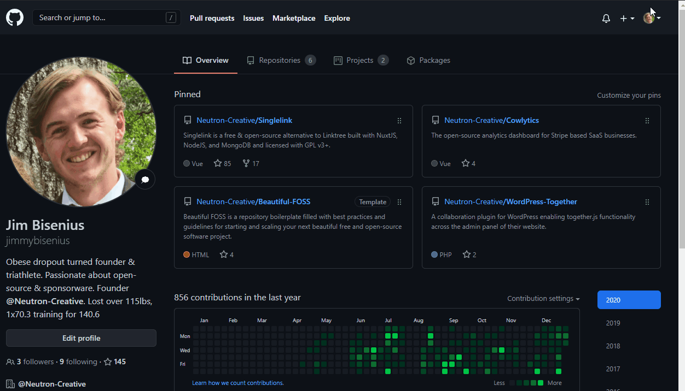

<h1 align="center">    </h1>
<h4 align="center">Sponsorware for Github is a sponsorware library for selling sponsorware software on Github via Github sponsors.</h4>

	
	
	

	<a href="https://twitter.com/neutroncreative">
		
	</a
	

    <a href="#prerequisites">Pre-requisites</a> •
	<a href="#get-started">Get started</a> •
	<a href="#faq">Frequently Asked Questions</a> •
	<a href="#related">Related</a> •
	<a href="#credits">Credits</a> •
	<a href="#license">License</a>

 
<h2 id="prerequisites">Pre-requisites</h2>

To deploy Sponsorware for Github on your projects, you'll need the following (all free, no credit card required).

- A Netlify account (https://netlify.com)
- A Github account (https://github.com)
- A Github personal access token ([Read more](https://docs.github.com/en/free-pro-team@latest/github/authenticating-to-github/creating-a-personal-access-token))
- A public Github sponsors profile (https://github.com/sponsors)
- A Github repositories to sell access to

 

 
<h2 id="get-started">Get started</h2>

Before we get started - double-check the pre-requisites in the previous section to ensure you're ready to go. Once we're certain, it's a quick and easy process to get started selling software on Github with the instructions below.

**1. Accept the invitation & fork the Sponsorship-Github repository**
	
	  
**2. Create a new website on Netlify, and set it to auto-deploy from your cloned repository**
	
	  
**3. Fill out the GITHUB_USER, GITHUB_REPO, and GITHUB_TOKEN environment variables on Netlify**
	
	  
**4. Rebuild & clear cache on Netlify**
	
	  
**5. Add your new Netlify webhook to your Github Sponsorship page**
	
	  
**6. You're ready to start selling on Github! 🥳** 
	Make sure you tell people about your new sponsorware, and let people know what they're buying when they sponsor your profile!

 

<h2 id="faq">Frequently Asked Questions</h2>

#### What if I can't get this setup?
Contact Jim Bisenius via DM on [Discord](https://discord.com/invite/3pBM4Px)! I'd be happy to help get it installed personally 🤠

#### What happens if I cancel my subscription?
Great question! You can cancel your subscription at anytime and your repository privliges will be revoked and a final copy of the software for you to via before you lose access to all future updates. **TLDR: You just lose access to updates, your software will still work**

 

<h2 id="related">Related</h2>

Have questions or need support? We're always able to answer any questions or help you however needed via email at [support@neutroncreative.com](mailto:support@neutroncreative.com) or via [Discord](https://discord.com/invite/3pBM4Px), with Discord being the quickest if you need urgent help.

 

<h2 id="license">License</h2>

Copyright (C) 2020 Neutron Creative Inc. All rights reserved.

Once Neutron Creative reaches 100 sponsors on Github Sponsors, Github Sponsorware will be open-sourced to the community under GPL v3+.